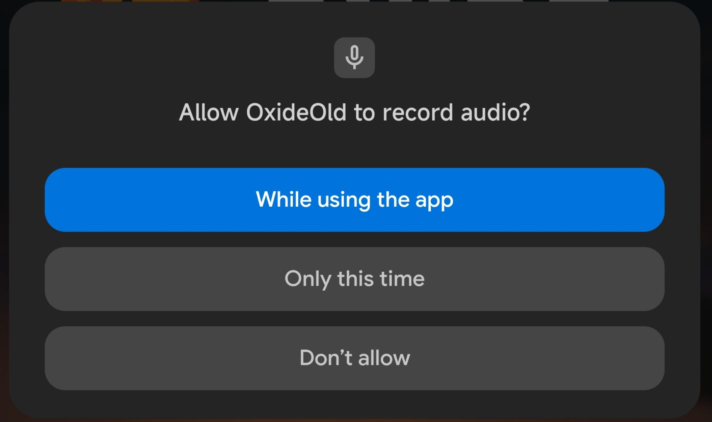

# UnitВroid Permissions



*Based on Unity Android Runtime Permissions (MIT License): https://github.com/yasirkula/UnityAndroidRuntimePermissions*

This plugin will help you set up Android permissions easily.

## INSTALLATION

There are 3 ways to install this plugin:

- import [UnitDroidPermissions.unitypackage](https://github.com/ShavuhaCode/UnitDroidPermissions/releases) via *Assets-Import Package*
- clone/[download](https://github.com/ShavuhaCode/UnitDroidPermissions/archive/master.zip) this repository and move the *Plugins* folder to your Unity project's *Assets* folder
- *(via Package Manager)* click the + button and install the package from the following git URL:
  - `https://github.com/ShavuhaCode/UnitDroidPermissions.git`

## HOW TO

Before we start, there is one optional step: by default, Unity shows a permission dialog on startup to prevent plugins from crashing/malfunctioning. This can be disabled, if you want; but you must make sure to handle all the runtime permissions carefully in your app's lifecycle. To disable this dialog, add the following line inside the `<application>...</application>` tag of *Plugins/Android/AndroidManifest.xml*:

```xml
<meta-data android:name="unityplayer.SkipPermissionsDialog" android:value="true" />
```

**NOTE:** if your project doesn't have an AndroidManifest, you can enable *Edit/Project Settings/Player/Publishing Settings/Custom Main Manifest*.

You can use the following *static* functions of **AndroidRuntimePermissions** to manage runtime permissions:

`bool CheckPermission( string permission )`: checks whether or not the permission is granted

`bool[] CheckPermissions( params string[] permissions )`: queries multiple permissions simultaneously. The returned array will contain one entry per queried permission

`void RequestPermissionAsync( string permission, Action<Permission> callback )`: requests a permission from the user and returns the result asynchronously. It is recommended to show a brief explanation before asking the permission so that user understands why the permission is needed and doesn't click Deny or worse, "Don't ask again". **Permission** is an enum that can take 3 values: 
- **Granted**: permission is granted
- **ShouldAsk**: permission is denied but we can ask the user for permission once again. As long as the user doesn't select "Don't ask again" while denying the permission, ShouldAsk is returned
- **Denied**: we don't have permission and we can't ask the user for permission. In this case, user has to give the permission from app's Settings. This happens when user selects "Don't ask again" while denying the permission or when user is not allowed to give that permission (parental controls etc.)

`void RequestPermissionsAsync( string[] permissions, Action<Permission[]> callback )`: requests multiple permissions simultaneously

`Task<Permission> RequestPermissionAsync( string permission )`: Task-based overload of RequestPermissionAsync

`Task<Permission[]> RequestPermissionsAsync( string[] permissions )`: Task-based overload of RequestPermissionsAsync

`void OpenSettings()`: opens the settings for this app, from where the user can manually grant permission(s) in case a needed permission's state is *Permission.Denied*

## EXAMPLE CODE

The following code requests *RECORD_AUDIO* permission (it must be declared in *AndroidManifest*) when bottom-right corner of the screen is touched:

```csharp
void Start()
{
    if (!UnitDroidPermissions.CheckPermission("android.permission.READ_MEDIA_AUDIO"))
	        RequestPermission();
}

void RequestPermission()
{
	AndroidRuntimePermissions.Permission result = await AndroidRuntimePermissions.RequestPermissionAsync("android.permission.RECORD_AUDIO");
	if(result == AndroidRuntimePermissions.Permission.Granted)
		Debug.Log("We have permission to microphone!");
	else
		Debug.Log("Permission state: " + result);
}
```
